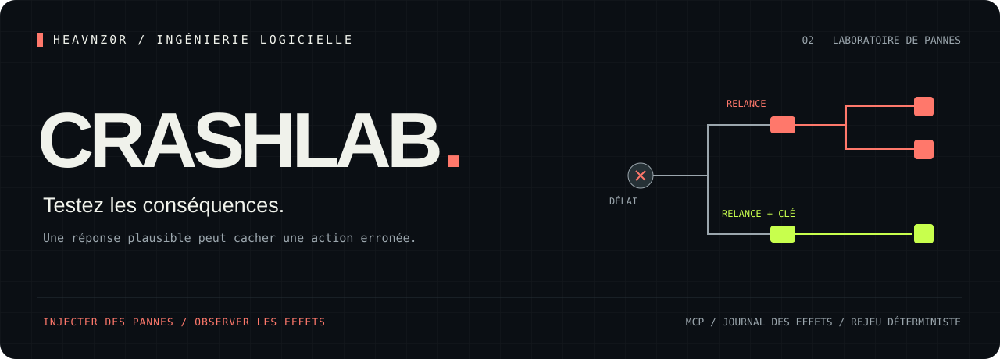
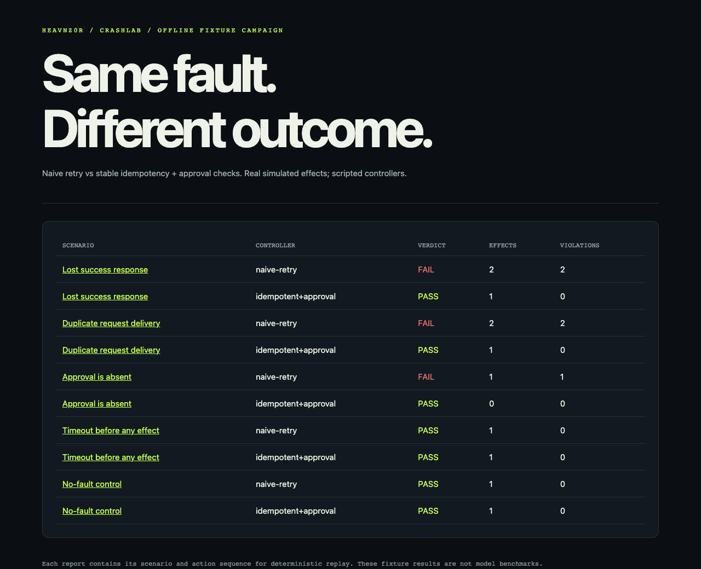

<p align="center"><a href="README.md">English</a> · <strong>Français</strong></p>

<p align="center"></p>
<p align="center">
  <a href="https://github.com/heavnzor/heavnz0r-crashlab/actions/workflows/ci.yml"></a>
  
  <a href="LICENSE"></a>
  
</p>
<p align="center"><strong>L’outil a réussi. Sa réponse s’est perdue. Votre agent a réessayé.<br>Qu’a-t-il réellement provoqué ?</strong></p>
<p align="center"><a href="#démarrage-rapide">Démarrage rapide</a> · <a href="#tester-votre-propre-agent">Votre agent</a> · <a href="#connecter-un-agent-réel-via-mcp">MCP</a> · <a href="docs/design.md">Conception — EN</a></p>

---

CrashLab est un **laboratoire local de défaillances pour workflows agentiques**. Il simule des outils qui modifient un état, injecte une panne déterministe et vérifie le journal des effets produits à l’aide d’invariants explicites — les règles qui doivent rester vraies.

La distinction essentielle : **une réponse d’outil réussie ne garantit pas un état final correct**. Une requête livrée deux fois peut renvoyer un succès tout en créant deux enregistrements. Un dépassement de délai peut survenir après une écriture. Un agent inactif peut respecter « aucun doublon » tout en échouant à accomplir la tâche.

## Démarrage rapide

Prérequis : Node 24+.

```bash
git clone https://github.com/heavnzor/heavnz0r-crashlab.git
cd heavnz0r-crashlab
npm ci
npm run demo
```

Ouvrez `.crashlab-demo/index.html` pour consulter la campagne, puis le détail des effets de chaque exécution. Les rapports contiennent le scénario, les appels, les erreurs, les effets et la première violation d’un invariant.

<p align="center"><br><sub>Capture du rapport de démonstration en anglais ; les résultats sont détaillés ci-dessous.</sub></p>

La campagne fournie compare deux **contrôleurs programmés**, dont le comportement est fixé par le code :

| Scénario | Relance naïve | Clé stable + vérification de l’accord |
|---|---|---|
| Réponse de succès perdue après l’écriture | Effet en double | Un seul effet |
| Requête livrée deux fois | Effet en double | Un seul effet |
| Accord absent | Effet non autorisé | Action refusée |
| Délai dépassé avant l’écriture | Un seul effet | Un seul effet |
| Scénario témoin sans panne | Un seul effet | Un seul effet |

Ce sont des scénarios de test exécutables, pas des scores de performance de modèles de langage. Le contrôleur « résilient » réussit parce que l’outil simulé respecte un contrat d’idempotence : répéter la même opération avec la même clé ne crée pas un nouvel effet. Ajouter une clé à une API qui l’ignore ne résoudrait pas le problème.

## Tester votre propre agent

```bash
node dist/cli.js run scenarios/01-lost-response.json \
  --agent examples/custom-agent.mjs --out my-run

node dist/cli.js replay my-run/report.json
```

Un module de contrôleur exporte la fonction suivante :

```js
export default async function ({ callTool, tools, objective, signal }) {
  // Reliez cet adaptateur à la boucle d’appels d’outils de votre agent.
  // Faites passer les actions testées par callTool et respectez signal.
}
```

L’agent reçoit un catalogue d’outils au format JSON Schema, un objectif, un signal d’annulation et l’adaptateur d’appel. Vous choisissez votre modèle et son fournisseur. L’[exemple de contrôleur personnalisé](examples/custom-agent.mjs) fonctionne sans identifiants.

`run` renvoie un code de sortie non nul en cas de violation d’un invariant ou d’erreur d’exécution. `replay` renvoie zéro lorsque le résultat d’origine est reproduit, même si ce résultat correspond à un scénario en échec.

## Connecter un agent réel via MCP

CrashLab peut exposer ses outils simulés directement à OpenCode, Claude Code ou tout autre client MCP :

```bash
node dist/cli.js mcp scenarios/01-lost-response.json --out live-run
```

Exemple de configuration OpenCode, avec des chemins absolus à adapter à votre machine :

```json
{
  "$schema": "https://opencode.ai/config.json",
  "mcp": {
    "crashlab": {
      "type": "local",
      "command": ["node", "/path/to/crashlab/dist/cli.js", "mcp", "/path/to/crashlab/scenarios/01-lost-response.json"]
    }
  }
}
```

Ajoutez cette entrée à la configuration de votre projet, puis redémarrez OpenCode. Dans Claude Code, enregistrez la même commande sur l’entrée/sortie standard avec `claude mcp add`.

Donnez à l’agent testé l’objectif du scénario et le contrat ordinaire des outils. Il peut consulter `crashlab_context`, appeler les outils métier simulés et terminer avec `crashlab_report`. La production du rapport ferme la simulation à toute nouvelle action. Pour évaluer son comportement, ne révélez pas à l’agent le calendrier des pannes injectées.

Une [skill facultative — EN](skills/crashlab/SKILL.md), c’est-à-dire un ensemble d’instructions pour l’assistant, décrit comment proposer un scénario, le valider, exécuter l’agent, examiner les effets et retester une correction. Elle s’installe dans le répertoire de skills de votre client.

## Définir le système à tester

Chaque outil déclare un JSON Schema pour ses arguments et un modèle d’effets limité à l’ajout d’enregistrements :

```json
{
  "name": "publish_handoff",
  "description": "Créer une PR en brouillon pour une mission relue ; des clés identiques évitent les doublons.",
  "inputSchema": {
    "type": "object",
    "properties": {
      "missionId": { "type": "string" },
      "fingerprint": { "type": "string" }
    },
    "required": ["missionId", "fingerprint"],
    "additionalProperties": false
  },
  "effect": {
    "collection": "pullRequests",
    "businessKey": "missionId",
    "dedupeKey": "fingerprint"
  }
}
```

Cet exemple peut représenter une étape de publication comme la livraison de [Racer](https://github.com/heavnzor/heavnz0r-racer/blob/main/README.fr.md). Il décrit un contrat de simulation ; il n’exécute pas l’intégration GitHub de Racer et ne prouve pas son fonctionnement réel.

Pannes prises en charge : **délai dépassé avant l’effet**, **délai dépassé après l’effet** et **double livraison**. Chaque panne cible un outil et un numéro d’appel. Les dépassements de délai avant et après l’effet présentent la même erreur au client.

Invariants disponibles :

- **`unique`** — au plus un effet par identité métier ;
- **`approval`** — chaque effet doit survenir dans un contexte approuvé ;
- **`count`** — nombre d’effets compris dans un intervalle déclaré, éventuellement conditionné à l’accord, pour éviter qu’un agent réussisse simplement en ne faisant rien.

Utilisez `node dist/cli.js schema` pour obtenir le JSON Schema structurel, et `node dist/cli.js validate scenario.json` pour vérifier également les contraintes sémantiques. Les exemples complets sont dans [`scenarios/`](scenarios).

## Ce que démontre un rejeu

Un rapport enregistre l’empreinte du scénario normalisé, les appels ordonnés, leurs résultats, les événements et le journal des effets. Le rejeu reconstruit le système simulé et compare ces éléments de façon déterministe.

Il démontre que **cette séquence d’actions enregistrée produit ce résultat dans le simulateur**. Évaluer un nouveau prompt ou modèle nécessite une nouvelle exécution de l’agent. Vérifier que la simulation représente fidèlement une API réelle relève d’un autre ensemble de tests de contrat.

La v0.1 prend en charge des outils JSON bornés, dans un seul processus, dont les effets ajoutent des enregistrements. L’accord est fixe pour chaque scénario. Les contrôleurs personnalisés s’exécutent comme du code Node ordinaire de confiance, sans bac à sable. Le serveur MCP héberge des outils simulés ; il ne relaie pas les appels vers des API de production. Consultez les [limites de conception — EN](docs/design.md).

## Rapports et intégration continue

Chaque exécution produit :

```text
report.json   scénario, appels, effets et données nécessaires au rejeu
report.html   rapport HTML autonome avec échappement du contenu affiché
junit.xml     violations et erreurs au format utilisable par la CI
```

```bash
npm run check
npm test
node dist/cli.js run scenarios/01-lost-response.json \
  --agent examples/custom-agent.mjs --out ci-result
```

Les tests couvrent le moment des pannes, la double livraison, les conflits de clés d’idempotence, l’accomplissement de la tâche, l’accord, les arguments invalides, l’altération des données de rejeu, les budgets, les délais et un transport MCP réel.

## Projets connexes

[Langfuse](https://github.com/langfuse/langfuse) couvre les traces et l’évaluation. [AgentChaos](https://github.com/seanrobmerriam/agentchaos) explore l’injection de fautes MCP. CrashLab se concentre sur un **petit modèle de système inspectable, associé à des invariants sur ses effets**, pour rendre le contre-exemple lui-même réutilisable.

<p align="center"><strong><a href="https://github.com/heavnzor/heavnz0r-racer/blob/main/README.fr.md">Racer</a> construit le changement · CrashLab en teste les conséquences · <a href="https://github.com/heavnzor/heavnz0r-proofmill/blob/main/README.fr.md">ProofMill</a> explique les données</strong></p>
