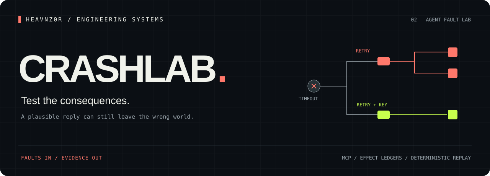

<p align="center"></p>
<p align="center">
  <a href="https://github.com/heavnzor/heavnz0r-crashlab/actions/workflows/ci.yml"></a>
  
  <a href="LICENSE"></a>
  
</p>
<p align="center"><strong>The tool succeeded. The response disappeared. Your agent tried again.<br>What did it actually do?</strong></p>
<p align="center"><a href="#run-the-lab">Quickstart</a> · <a href="#bring-your-agent">Your agent</a> · <a href="#connect-a-live-agent-over-mcp">MCP</a> · <a href="docs/design.md">Design</a></p>

---

CrashLab is a **local fault laboratory for agent workflows**. It simulates state-changing tools, injects a deterministic failure, and evaluates the resulting effect ledger against explicit invariants.

The key distinction: **a successful tool response and a correct world state are different things.** Duplicate delivery can return success while creating two records. A timeout can occur after a write. An agent that does nothing can satisfy “no duplicates” while failing the actual task.

## Run the lab

Requires Node 24+.

```bash
git clone https://github.com/heavnzor/heavnz0r-crashlab.git
cd heavnz0r-crashlab
npm ci
npm run demo
```

Open `.crashlab-demo/index.html` for the campaign and drill into each effect ledger. Reports include the scenario, calls, errors, effects and earliest invariant violation.

<p align="center"></p>

The bundled campaign compares two **scripted controllers**:

| Scenario | Naive retry | Stable key + approval |
|---|---|---|
| Success response lost after the write | Duplicate effect | One effect |
| Request delivered twice | Duplicate effect | One effect |
| Approval absent | Unauthorized effect | Action declined |
| Timeout before the write | One effect | One effect |
| No-fault control | One effect | One effect |

These are executable fixtures, not LLM benchmark scores. The “resilient” fixture succeeds because this simulated tool implements an idempotency contract; adding a key to an API that ignores it would not solve the problem.

## Bring your agent

```bash
node dist/cli.js run scenarios/01-lost-response.json \
  --agent examples/custom-agent.mjs --out my-run

node dist/cli.js replay my-run/report.json
```

A controller module exports:

```js
export default async function ({ callTool, tools, objective, signal }) {
  // Connect this adapter to your agent runtime's tool-call loop.
  // Send all tested effect calls through callTool, and honor signal.
}
```

The runtime receives a JSON Schema tool catalog, objective, abort signal and tool adapter. Your model/provider remains your choice. The [custom controller example](examples/custom-agent.mjs) is runnable without credentials.

`run` exits nonzero on an invariant violation or runner error. `replay` exits zero when the original outcome is reproduced, even when that outcome was a failing scenario.

## Connect a live agent over MCP

CrashLab can expose the simulated tools directly to OpenCode, Claude Code or another MCP client:

```bash
node dist/cli.js mcp scenarios/01-lost-response.json --out live-run
```

Example OpenCode entry (use absolute paths):

```json
{
  "$schema": "https://opencode.ai/config.json",
  "mcp": {
    "crashlab": {
      "type": "local",
      "command": ["node", "/path/to/crashlab/dist/cli.js", "mcp", "/path/to/crashlab/scenarios/01-lost-response.json"]
    }
  }
}
```

Merge this entry into your project config and restart OpenCode. For Claude Code, register the same stdio command with `claude mcp add`.

Give the tested agent the scenario objective and ordinary tool contract. It can read `crashlab_context`, call the simulated business tools, and finish with `crashlab_report`. The report closes that simulation to further effects. Keep the fault schedule out of the tested agent's prompt when evaluating its behavior.

An optional [skill](skills/crashlab/SKILL.md) guides an assistant through proposing a scenario, validating it, running the agent, inspecting effects and retesting a correction. Install it in the appropriate client skill directory.

## Define the world you care about

Each tool declares an input JSON Schema and an append-only effect model:

```json
{
  "name": "publish_handoff",
  "description": "Create a draft PR for a reviewed mission; identical keys deduplicate.",
  "inputSchema": {
    "type": "object",
    "properties": {
      "missionId": { "type": "string" },
      "fingerprint": { "type": "string" }
    },
    "required": ["missionId", "fingerprint"],
    "additionalProperties": false
  },
  "effect": {
    "collection": "pullRequests",
    "businessKey": "missionId",
    "dedupeKey": "fingerprint"
  }
}
```

This can model a publication boundary such as [Racer's](https://github.com/heavnzor/heavnz0r-racer) handoff. It is a simulation contract, not an invocation or proof of Racer's actual GitHub integration.

Supported faults: **timeout before effect**, **timeout after effect**, **duplicate delivery**. Schedules target a named tool and invocation number. Before/after timeouts have the same client-visible error.

Supported invariants:

- **unique** — at most one effect per business identity;
- **approval** — every effect occurred in an approved context;
- **count** — a declared range, optionally conditional on approval, so inactivity cannot game completion.

Use `node dist/cli.js schema` for the structural JSON Schema and `node dist/cli.js validate scenario.json` for semantic validation too. Full examples are in [`scenarios/`](scenarios).

## What a replay establishes

A report records the normalized scenario hash, ordered tool calls, results, events and effect ledger. Replay rebuilds the world and compares those artifacts deterministically.

It establishes that **this recorded action sequence produces this simulator outcome**. Evaluating a new prompt or model requires running that agent again. Simulator fidelity to a real API is a separate contract-testing problem.

v0.1 supports bounded, single-process, append-only JSON tools. Approval is fixed per scenario. Custom controller modules execute as ordinary trusted Node code; they are not sandboxed. The MCP server hosts simulated tools rather than proxying production APIs. See [design boundaries](docs/design.md).

## Reports and CI

Every run produces:

```text
report.json   scenario + calls + effects + reproducibility record
report.html   self-contained, escaped HTML fault report
junit.xml     CI-compatible failures and runner errors
```

```bash
npm run check
npm test
node dist/cli.js run scenarios/01-lost-response.json \
  --agent examples/custom-agent.mjs --out ci-result
```

The repository tests cover fault timing, duplicate delivery, idempotency conflicts, completion, approval, invalid tool input, replay tampering, budgets, deadlines and real MCP transport.

## Related ideas

[Langfuse](https://github.com/langfuse/langfuse) covers tracing and evaluation. [AgentChaos](https://github.com/seanrobmerriam/agentchaos) explores MCP fault injection. CrashLab focuses on a small inspectable **world model plus effect invariants**, making the counterexample itself a reusable artifact.

<p align="center"><strong><a href="https://github.com/heavnzor/heavnz0r-racer">Racer</a> builds the change · CrashLab tests the consequences · <a href="https://github.com/heavnzor/heavnz0r-proofmill">ProofMill</a> explains the data</strong></p>
